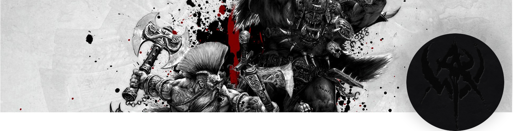

  

<h3 align="center">
ProjectWaaagh - MMORPG Framework
</h3>

ProjectWaaagh is a MMORPG Framework based mostly in C++.

It is derived from TrinityCore, the Massive Network Game Object Server, and is based on the code of that project with extensive changes over time to optimize, improve and cleanup the codebase at the same time as improving the in-game mechanics and functionality.

It is completely open source; community involvement is highly encouraged.

Table of Contents

- [About](#about)
- [Install](Documents/index.md)
- [Reporting issues](#reporting-issues)
- [Submitting fixes](#reporting-fixes)
- [Copyright](#copyright)
- [Authors & Contributors](#authors--contributors)
- [Links](#links)

## About
ProjectWaaagh is a MMORPG Framework based mostly in C++.
It is derived from TrinityCore, the Massive Network Game Object Server, and is based on the code of that project with extensive changes over time to optimize, improve and cleanup the codebase at the same time as improving the in-game mechanics and functionality.
It is completely open source; community involvement is highly encouraged.
If you wish to contribute ideas or code, please visit our site linked below or make pull requests to our [Github](https://bitbucket.org/monophonique/project-waaagh/src) repository.
For further information on the ProjectWaaagh project, please visit our project website at [Project-Waaagh.net](https://www.project-waagh.net).

### Reporting issues
Issues can be reported via the Github issue tracker.

Please take the time to review existing issues before submitting your own to prevent duplicates.

In addition, thoroughly read through the issue tracker guide to ensure your report contains the required information. Incorrect or poorly formed reports are wasteful and are subject to deletion.

### Reporting fixes
C++ fixes are submitted as pull requests via Github. For more information on how to properly submit a pull request, read the how-to: maintain a remote fork. For SQL only fixes, open a ticket; if a bug report exists for the bug, post on an existing ticket.

## Copyright
License: GPL 2.0

Read FILE [COPYING](COPYING)

## Authors & Contributors
Read FILE [AUTHORS](AUTHORS)

## Links
- [Website](https://www.project-waaagh.net)
- [Wiki]()
- [Forums]()
- [Discord]()